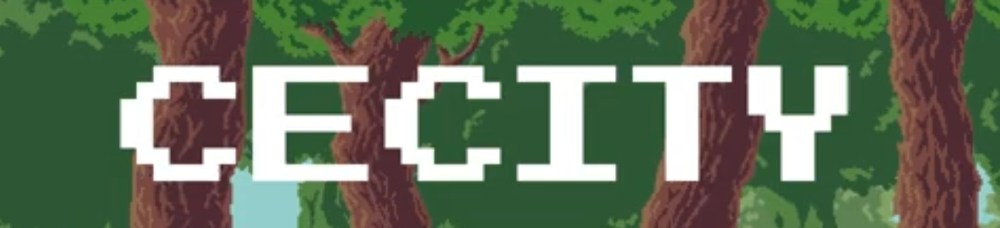

# [Cecity]

## Game Overview
 Genre:** Sidescrolling Hack-n-Slash
 Platform:** Windows  
 Development Time:** 1 month  
 Godot Version:** 4.5.1
 Course:** GAME 360 - Development with Game Engines, Fall 2025
 
## How to Play
[Z to dodge roll and X to attack]
[ left and right arrow keys]
## Features
[ Player movement and basic controls ]
[ Basic enemy with proper group fight decision making]
[Win/lose conditions]
[UI (health) ]
[Audio system (music + SFX]

[Weapon combos]

Implemented Mechanics
- Hack n slash 3 hit combo
- Dodge Roll
- Kill enemies and High kill score
- Enemy AI - multiple enemies attack
- one level/ one scene
- Win/Lose Conditions - Game over and Victory
## Architecture
Menu screens, including a main menu, pause menu, and end screens, are present. The main menu screen has options to start and quit. The pause menu has options to resume, restart, and quit. Both the game over and victory screens have restart and quit functions.
The player and the enemies all have health bars. Enemies die when their health reaches zero. When the player has zero health, the game over screen appears. When the boss at the end dies, the player wins and the victory screen is shown.
## Development Statistics
- Total Commits: 41
- Development Time: 1 Month on and off. We cannot estimate our total hours.
##  Screenshots

*Main gameplay showing combat*

*Main menu interface*

*Victory screen*
 
## Credits
 Music - Elhadg Diouf
Sound - https://youtu.be/OO0T3cq_z50?si=T7V4l-NUgXGzYkLZ
 Art Assets - 
https://youtu.be/OO0T3cq_z50?si=T7V4l-NUgXGzYkLZ
https://sismodyn.itch.io/ancientforest
Cameron Hise (Some Monster Sprites)
 
## Post-Mortem
 - What we learned
We learned a lot about using the Godot Engine, including programming, map design, and the implementation of states and menus. 
Something we need to work on is ambition as well as time management. We might have overestimated what we wanted to do, and as a result, we had to make several compromises. Despite that, we think the game turned out well.
 - Future Improvements
All original sprites, replacing various sprites for the player, environments, enemies, and more.
New enemies.
New levels.
More combos, actions, and mechanics.
 
 Developer
**Elhadg Diouf**  
Student ID: [01248121]  
Old Dominion University - GAME 360  
Fall 2025  
Email: Ediou001@odu.edu

**Cameron Hise**  
Student ID: 01200222  
Old Dominion University - GAME 360  
Fall 2025  
Email: chise001@odu.edu  

**[Mark Stoegbauer]**  
Student ID: 01279456
Old Dominion University - GAME 360  
Fall 2025  
Email: mstoe001@odu.edu

